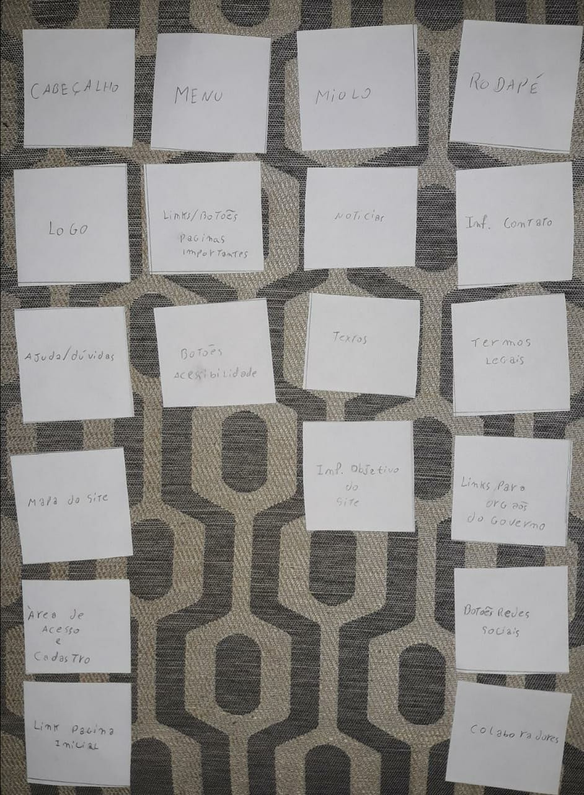
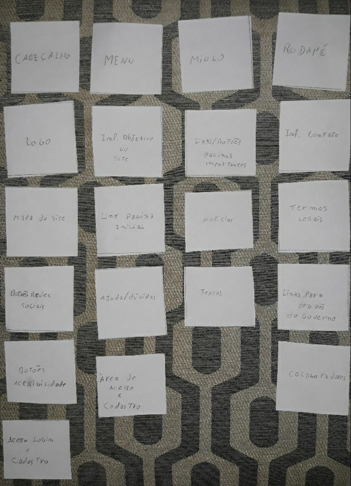

# Classificação de Cartões

## Introdução
A Classificação de Cartões é uma tecnica utilizada para informar ou guiar o projeto de arquitetura de um produto. Pode ser utilizada para levantar diferentes modelos de classificação, para explorar como as pessoas pensam sobre certos tópicos, para descobrir que categorias parecem semelhantes ou complementares, para descobrir sobre o que pode ser agrupado e o que não pode, e para coletar listas de palavras ou expressões que as pessoas utilizam para descrever grupos de informação (Spencer, 2009).

## Metodologia
Utilizamos a classificação de cartões fechada, onde os cartões foram divididos nas categorias:
- Cabeçalho
- Menu
- Miolo
- Rodapé

## Cartões (fichas)

Logo  
Informação para contato  
Informação objetivo do site  
Colaboradores  
Links para pagina inicial  
Termos legais  
Ajudas/dúvidas  
Mapa do site  
Links para redes sociais  
Links para páginas importantes  
Links para orgãos do governo  
Botões de acessibilidade  
Área de acesso (login) e cadastro  
Notícias  
Texto(informações sobre tema da pagina) 

## Classificações
Foram realizadas três classificações:

### Classificação 1:

### Classificação 1:

## Analise e resultado

## Referências Bibliográficas

>  Barbosa, Simone D. J.; Silva, Bruno S. Interação Humano-Computador. Editora Campus-Elsevier, 2010.

> Card Sorting Technique - Planning a website. Disponível em https://www.youtube.com/watch?v=FTzHeYPB9c8

> Spencer, D. Card Sorting: designing usable categories. Brooklyn, NY: Rosenfeld Media, 2009.

## Histórico de versões

| Data | Versão | Descrição | Autor(es) |
|:--:|:--:|:--:|:--:|
|13/10/19|1.0|Criação do documento|Moacir Mascarenha, Renan Cristyan|
