# Guia de Estilo

## 1. Introdução
O guia de estilo é um registro das principais decisões tomadas pelos designers, para que estas não se percam, e que sejam incorporadas ao produto final. 

## 2. A Quem se Destina ?
- Este guia de estilo pode beneficiar: 
- Programadores 
- Gerentes 
- Equipe de Suporte 

## 3. Estrutura dos Templates

### 3.1 Tipografia
A principal família tipográfica é a Arial e suas variações de estilos.A segunda família é a Helvetica. A terceira família é composta por Tahoma e Geneva sendo utilizadas em labels.

Em casos em que não for possível definir a família tipográfica, deve-se utilizar fontes do tipo “Sans Serif” (sem serifa).

#### ARIAL

#### ARIAL REGULAR
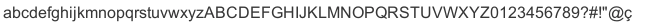

#### ARIAL BOLD
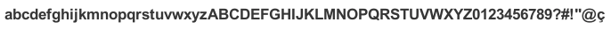

#### HELVETICA
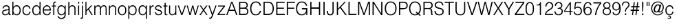

#### HELVETICA REGULAR
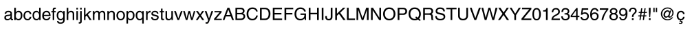

#### HELVETICA BOLD
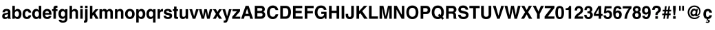

### 3.2 Cores
Cores em RGB e hexadecimal. Em cabeçalhos e rodapés a cor branca é substituida por um tom de cinza com o intuito de não gerar um contrates com o corpo do Site.

#### Principais 

#### Secundárias

### 3.3 Links

#### Normal(#006600) 

#### Ativado(#66CC00)

### 3.4 Icones

#### Icones de Acessibilidade
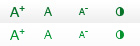

#### Icones Redes Sociais

## 4. Elementos da Estrutura Principal

Elementos Padrão de 
toda estrutura do 
site.

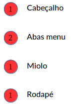

Estes elementos devem estar 
presente em todas as paginas.

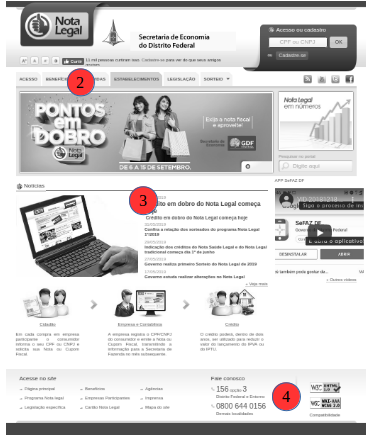

### 4.1 Cabeçalho
O cabeçalho (header) traz as informações básicas de identificação de um site como o nome, a qual ministério está subordinado, além dos menus de serviço, acessibilidade e redes sociais e a ferramenta de busca. 

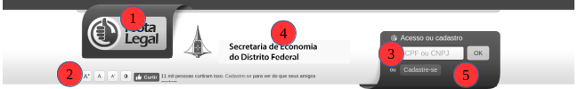
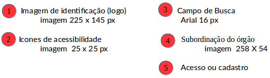

### 4.2 Menu

As abas devem se localizar logo abaixo do cabeçalho.
Abas ao ser selecionada a aba deve apresentar uma mudança de cor de ciza para amarelo.

#### Aba Normal
    Cor: #ddd
	Fonte: ARIAL
	Tamanho fonte: 12px

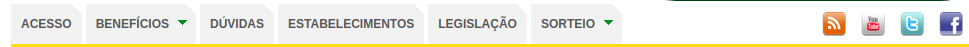

#### Aba Ativada
    Cor: #fed23b
	Fonte: ARIAL
	Tamanho fonte: 12px

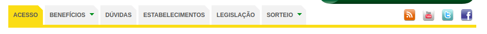

### 4.3 Abas

#### Acesso

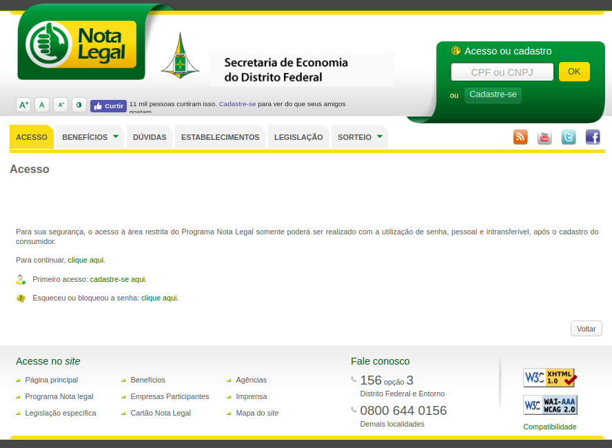

#### Benefícios
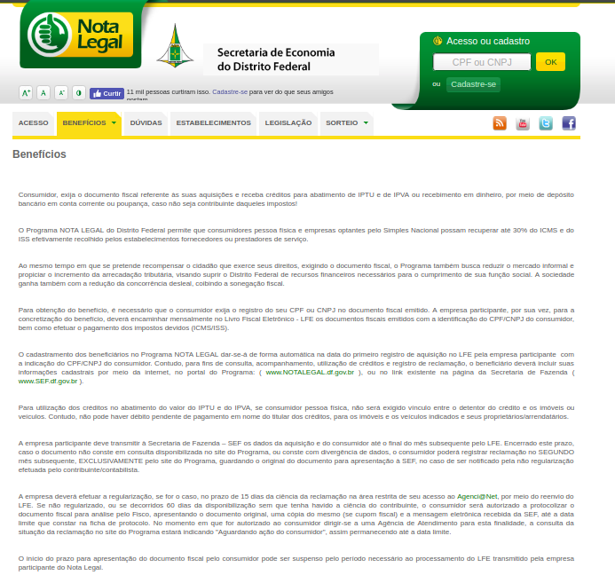
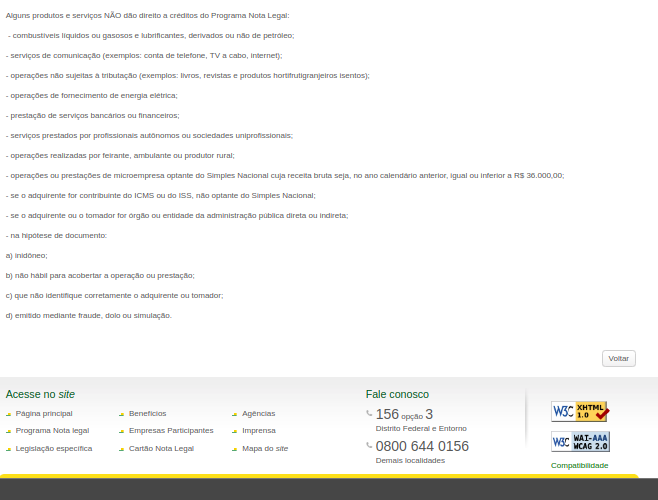

#### Dúvidas
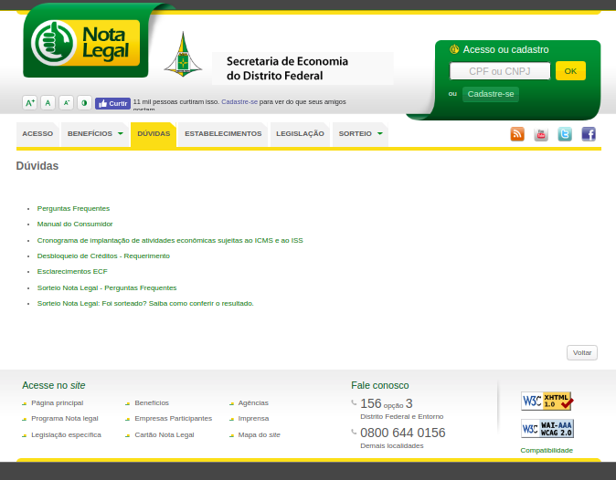

#### Estabelecimentos
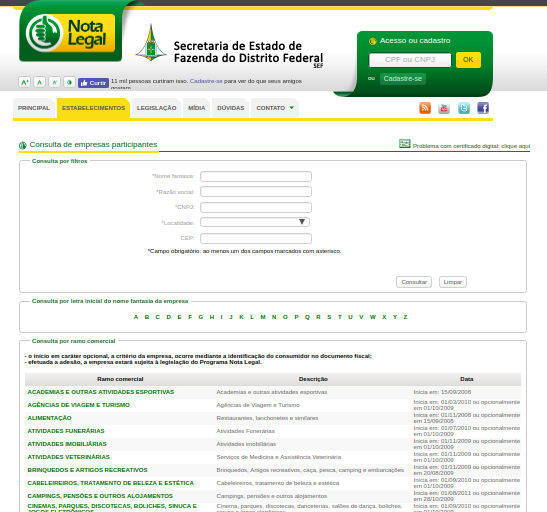

#### Legislação
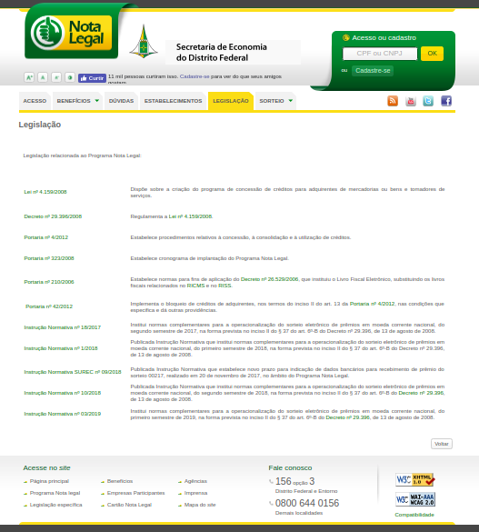

## Referências Bibliográficas

> Enclycopedia, Disponível em :https://encycolorpedia.pt/

> Guia de Estilo do Portal Institucional Padrão, Disponível em: http://www.secom.gov.br/orientacoes-gerais/comunicacao-digital/guia-de-estilo-identidade-padrao-comunicacao-digital-fev2015.pdf?

## Histórico de versões

| Data | Versão | Descrição | Autor(es) |
|:--:|:--:|:--:|:--:|
|13/09/19|1.0|Criação do documento|Moacir Mascarenha|
|05/10/19|1.1|Adição do documento no repositório|Moacir Mascarenha|