# Análise de tarefas

## 1.Introdução

Uma análise de tarefas é utilizada para se ter um entendimento sobre qual é o trabalho dos usuários, como eles o realizam e por quê realizam.Nesse tipo de análise, o trabalho é definido em termos dos objetivos que os usuários querem ou precisam atingir.

A análise de tarefas pode ser utilizada nas três atividades habituais:

- análise da situação atual (apoiada ou não por um sistema computacional),
- (re)design de um sistema computacional 
- avaliação do resultado de uma intervenção que inclua a introdução de um (novo) sistema computacional. 

## 2.Análise Hierárquica de Tarefas (HTA)

 Ajuda a relacionar o que
as pessoas fazem (ou se recomenda que façam), por que o fazem, e quais as consequências caso não o façam corretamente. Ela se baseia em psicologia funcional, e não comportamental, como eram as abordagens da época em que foi criada.

- **Objetivo**: Um objetivo é um estado específico de coisas, um estado final.Podendo ser definido por um ou mais eventos ou por valores fisicamente observáveis de uma ou mais variáveis, que atuam como critério de alcance do objetivo , em última instância, do desempenho do sistema.
- **Operação**: Uma operação é especificada pelas circunstâncias nas quais o objetivo é ativado
(input ou entrada), pelas atividades ou ações (actions) que contribuem para atingi-lo e pelas condições que indicam o seu atingimento (feedback).

### HTA01: Cadastro de Usuário

[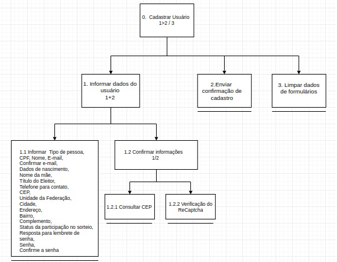](img/HTA/cadastrarUsuário.png)

### HTA02: Login

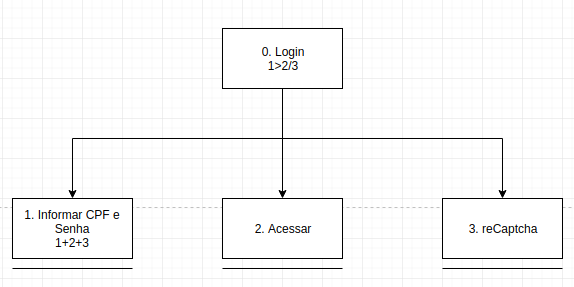

### HTA03: Gerar consumo

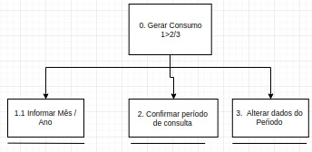

## Utilizar Crédito

### HT04: Abatimento no IPTU

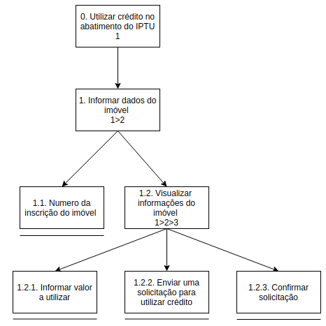

### HT05: Abatimento no IPVA

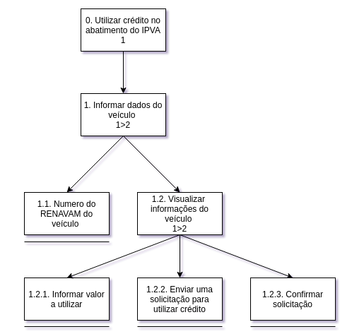

### HT06: Indicação para depósito em conta

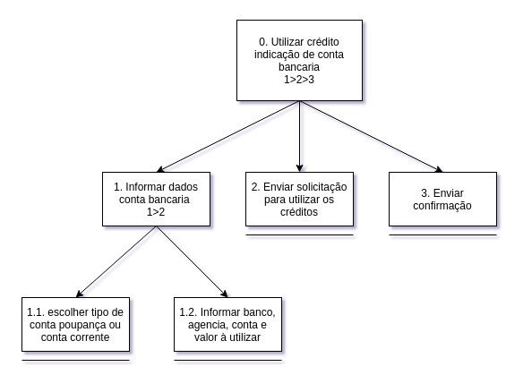

## 3. Árvores de Tarefas Concorrentes(ConcurTaskTrees – CTT)

O modelo de árvores de tarefas concorrentes tem como objetivo  auxiliar a avaliação e o design e avaliação de IHC.

#### Tipos de Tarefas 

- tarefas do usuário, realizadas fora do sistema.

- tarefas do sistema, em que o sistema realiza um processamento sem interagir com o usuário.

- tarefas interativas, em que ocorrem os diálogos usuário–sistema. 

- tarefas abstratas, que não são tarefas em si, mas sim uma representação de uma composição de tarefas que auxilie a decomposição.

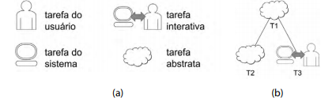

Figura a: Representações dos tipos de tarefas.

Figura b: Representações hierarquicas das tarefas no CTT.

### O CTT permite representar diversas relações entre as tarefas.

#### Relações entre tarefas:

- ativação: T1 >> T2 significa que a segunda tarefa (T2) só pode iniciar após a primeira tarefa (T1) terminar;
- ativação com passagem de informação: T1 [ ] >> T2 especifica que, além de
T2 só poder ser iniciada após T1, a informação produzida por T1 é passada
para T2;
-  escolha (tarefas alternativas): T1 [] T2 especifica duas tarefas que estejam habilitadas num momento, mas que, uma vez que uma delas é iniciada, a outra
é desabilitada;
- tarefas concorrentes: T1 ||| T2 especifica que as tarefas podem ser realizadas em qualquer ordem ou ao mesmo tempo;

- tarefas concorrentes e comunicantes: T1 | [ ] | T2 especifica que, além de as tarefas poderem ser realizadas em qualquer ordem ou ao mesmo tempo, elas
podem trocar informações;
- tarefas independentes: T1 |=| T2 especifica que as tarefas podem ser realizadas em qualquer ordem, mas quando uma delas é iniciada, precisa terminar
para que a outra possa ser iniciada;
- desativação: T1 [> T2 especifica que T1 é completamente interrompida por
T2;

- suspensão/retomada: T1 |> T2 especifica que T1 pode ser interrompida por T2
e é retomada do ponto em que parou assim que T2 terminar.

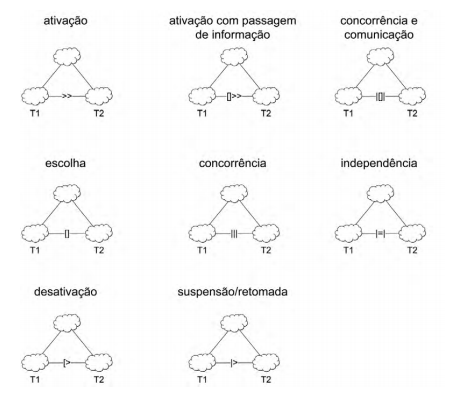

### CTT01: Cadastrar Usuário

[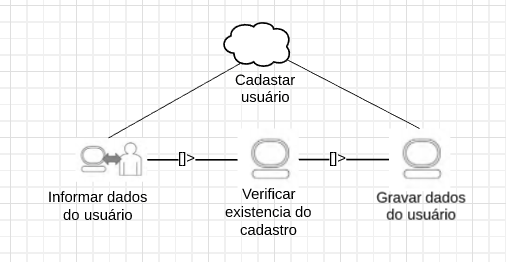](img/ctt1.png)

### CTT02: Realizar login

[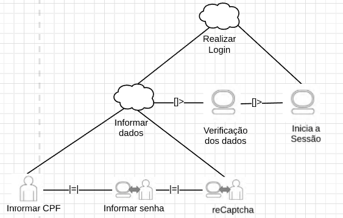](img/ctt2.png)

### CTT03: Gerar consumo

[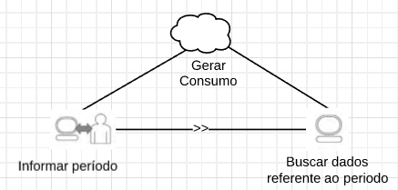](img/ctt3png)

## Referências Bibliográficas

> Barbosa, S.;Silva, B. Interação Humano Computador, Capítulo 6 Organização no espaço de problema.

## Histórico de versões

| Data | Versão | Descrição | Autor(es) |
|:--:|:--:|:--:|:--:|
|05/10/19|1.0|Criação do documento|Matheus Estanislau e Moacir Mascarenha|
|05/10/19|1.1|Adição do documento no repositório|Matheus Estanislau e Moacir Mascarenha|
|13/10/19|1.2|Adição do CTT|Matheus Estanislau e Moacir Mascarenha|