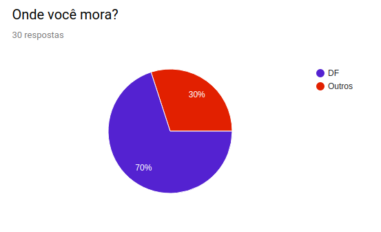

# Questionário

## Introdução

Questionário é uma técnica inflexível, pois é uma das técnicas que pode abranger um grande número de pessoas é o questionário. O seu uso é essencial quando se deseja obter informações de inúmeras pessoas. Além disso, justifica-se a sua aplicabilidade quando há indisponibilidade física, dispersão das pessoas envolvidas no projeto ou, até mesmo, quando há necessidade de um levantamento estatístico das pessoas que utilizaram o sistema.

## Perguntas

### Respostas de pessoas que usam o notal legal

### Respostas de pessoas que não usam o nota legal

## Considerações

A partir dos dados obtidos através do questionário, é possível tirar algumas conclusões. Grande parte dos usuários que responderam o questionário possuem mais de 40 anos e apenas a minoria possuem menos de 22 anos, ou seja, 75% tem mais de 22 anos. Já as pessoas que não utilizam, quase a metade tem entre 18 - 22 anos e apenas menor parte tem mais de 40 anos. Podendo concluir que quanto maior o faixa etária, maior o número de usuários

Há um equilibrio entre sexos que utilizam o notal legal, mais de 80% tem pelo menos ensino medio completo. Mais de 60% ganham mais de R$2000. 1/3 dos usuários utilizam o notal legal há mais de 4 anos.

|   Data   | Versão |           Descrição           |             Autor(es)              |
|:--------:|:------:|:-----------------------------:|:----------------------------------:|
| 10/10/2019 |  1.0   |   Criado o documento    |  João Pedro soares, lucas alexandre|
| 11/10/2019 | 1.1 | Adicionado as considerações| João Pedro, Lucas Alexandre|
| 13/10/2019 | 1.2 | Atulizado o questinário| Lucas Alexandre |