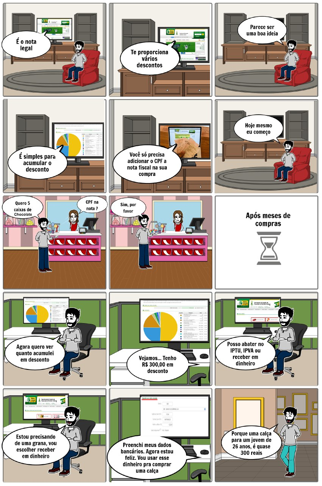

# Storyboard 

O storyboard é um esboço visual que ilustra a sequência de uma história. É composto por uma série de imagens em miniatura que transmite o que acontece no enredo, do começo ao fim. Inclui também notas sobre o que está acontecendo em cada quadro.

É muito parecido com uma história em quadrinhos. Normalmente, é desenhado à mão, ainda que algumas pessoas prefiram usar um software de storyboard para criar as imagens.

## Storyboard Nota legal 1.0

## Storyboard Nota legal 2.0

## Histórico de versões

| Data | Versão | Descrição | Autor(es|
|:--:|:--:|:--:|:--:|
|05/11/19|1.0|Adição storyboard 1.0| Matheus Rodrigues|
|25/11/19|2.0| Adição da introdução storyboard | Matheus Rodrigues|