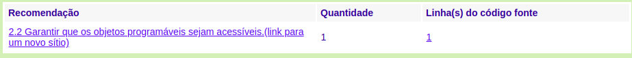

# Avaliação ASES(Avaliador e Simulador de Acessibilidade em Sítios)

## Introdução
O Avaliador e Simulador de Acessibilidade em Sites (ASES) é uma ferramenta que permite avaliar, simular e corrigir a acessibilidade de páginas, sítios e portais, sendo de grande valia para os desenvolvedores e publicadores de conteúdo.

## Página Inicial

### Recomendações:
**Marcação:**

**Comportamento:**

**Conteúdo/Informação:**

**Formulário:**

### Página Login

### Recomendações:
**Marcação:**

**Conteúdo/Informação:**

### Página Cadastro

### Recomendações:

**Marcação:**

**Conteúdo/Informação:**

## ResumoInicial

### Recomendações:

**Marcação:**

**Conteúdo/Informação:**

## Conclusão

Após a avalição de algumas páginas do site nota legal usando a plataforma de Avaliação e Simulação de Acessibilidade em sites, é evidente que as paginas avaliadas contem o nivel de acessibilidade ruim, de acordo com o padrão W3C.
s

## Referências 
 
 > Avaliador e Simulador de Acessibilidade em Sítios, Disponível em:http://asesweb.governoeletronico.gov.br/ases/

> Definição ASES , Disponível em:https://softwarepublico.gov.br/social/ases

## Histórico de versões
 
| Data | Versão | Descrição | Autor(es) |
|:--:|:--:|:--:|:--:|
|13/11/19|1.0|Adicionada a avaliação ASES|João Pedro, Moacir Mascarenha|