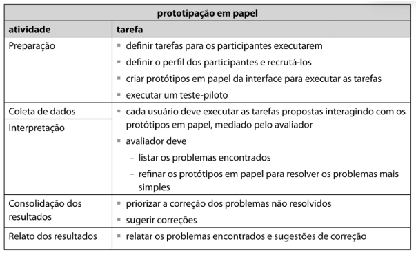

# Planejamento da Avaliação

## Introdução

A avaliação de IHC é uma atividade fundamental em qualquer processo de desenvolvimento que busque produzir um sistema interativo com alta qualidade de uso.Orientando o avaliador a fazer um julgamento da qualidade de uso da solução de IHC e a identificar problemas na interação e na interface que prejudiquem a experiência particular do usuário durante o uso do sistema.Sendo possivel corrigir problemas realacionados a qualidade de uso.

## Objetivo

### Identificar problemas na interação e interface no site Nota legal DF

#### Questões:

Considerando cada perfil de usuário esperado:
<ul> 
    <li>O usuário consegue operar o sistema? Ele atinge seu objetivo? Em quanto tempo? Após cometer quantos erros?
    <li>Que parte da interface e da interação o deixa insatisfeito?
    <li>Que parte da interface o desmotiva a explorar novas funcionalidades?
    <li>Ele entende o que significa e para que serve cada elemento de interface?
    <li>Ele vai entender o que deve fazer em seguida? 
    <li>Que problemas de IHC dificultam ou impedem o usuário de alcançar seus objetivos?
    <li>Onde esses problemas se manifestam? 
    <li>Com que frequência tendem a ocorrer? 
    <li>Qual é a gravidade desses problemas?
    <li>Quais barreiras o usuário encontra para atingir seus objetivos?
    <li>Ele tem acesso a todas as informações oferecidas pelo sistema?
</ul>

### Método de Avaliação

#### Observação

 Os métodos de <b>observação</b> fornecem dados sobre situações em que os usuários
realizam suas atividades, com ou sem apoio de sistemas interativos. Através do registro dos dados observados, esses métodos permitem identifi car problemas reais que
os usuários enfrentaram durante sua experiência de uso do sistema sendo avaliado 

#### Observação objetivos

Os objetivos da avaliação, detalhados por questões específicas, são os guias principais para o avaliador escolher os métodos de avaliação a serem utilizados.
como avaliar: preparação, coleta de dados,interpretação, consolidação e relato dos resultados. 

#### Prototipo de papel: 	
<ul>
    <li>escopo da	avaliação:
    Quais partes da interface, caminhos de interação, tarefas devem fazer parte da avaliação 
    <li>os métodos a serem	utilizados 
    <li>os perfis e o número de participantes
    <li>refletir sobre	as questões éticas e definir os cuidados que devem ser  tomados
    <li>alocar pessoal, recursos e equipamentos	
    <li>preparar e imprimir	o material de apoio:
    <li>termo de consentimento 
    <li>questionário	(ou roteiro de	entrevista) pré e pós-teste 
    <li>instruções e cenários para orientar os participantes sobre as tarefas a serem realizadas; 
    <li>roteiro de acompanhamento da observação de modo a facilitar a	 captura de dados e anotações 
    <li>preparar todo ambiente, hardware	e software 
    <li>realizar um teste-piloto 
    <li>recrutar participantes
</ul>

#### Prototipo de papel Resultados
<ul>
    <li> Os bojetivos da avaliação
    <li> breve descrição do método
    <li>O número e o perfil de avaliadores e dos participantes
    <li>As tarefas executadas pelos participantes
    <li>Uma lista de probelmas de usabilidade corrigidos durante os ciclos de avaliação e reprojeto, indicando:
        <ul>
            <li> Local onde ocorreu
            <li> Fatores de usabilidade prejudicados
            <li>Descrição e justificativa do problema
            <li> Correção reealizada no protótipo em papel
            <li> Indicação se o problema voltou a ocorrer depois da correção
        </ul>
</ul>

## Referências
>Barbosa, S.;Silva, B. Interação Humano Computador, Capítulo 9 Planejamento da Avaliação de IHC.

## Histórico de versões

| Data | Versão | Descrição | Autor(es) |
|:--:|:--:|:--:|:--:|
|03/11/19|1.0|Criação do documento|João Pedro, Moacir Mascarenha|

